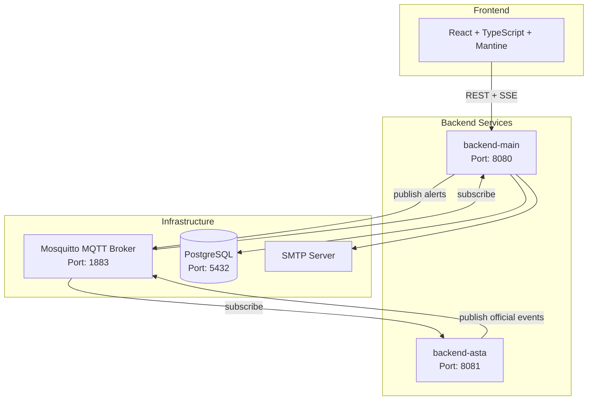
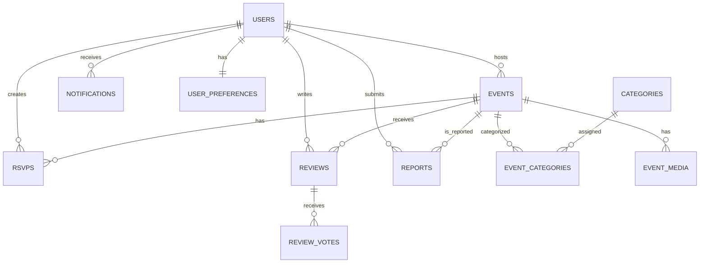
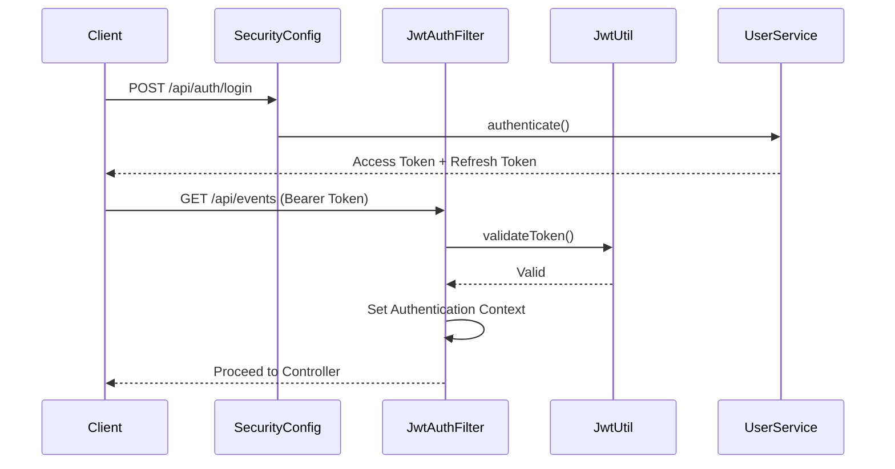

# 🏗️ MyStudyApp Backend Architecture Document

> **Version**: 2.0 | **Date**: 2026-07-14  
> **System**: Campus Event Platform  
> **Backend Framework**: Spring Boot 3.x  

---

## 1. Architectural Overview

MyStudyApp is a **campus event management platform** designed for university communities. The backend is built on a **microservices-inspired** architecture, consisting of **two Spring Boot applications** that communicate via an **MQTT message broker**. The system provides event discovery, registration, moderation, and real-time updates, with a strong focus on **trust-based moderation** and **user engagement**.

### 1.1 High‑Level System Diagram



### 1.2 Key Architectural Principles

- **Domain‑Driven Design (DDD)** – each package corresponds to a bounded context (`events`, `identity`, `moderation`, `registration`, `notification`).
- **Hexagonal Architecture** – core domain logic is isolated; external communication (web, MQTT, email, file storage) is handled via adapters.
- **Event‑Driven Communication** – internal Spring events decouple modules; MQTT bridges external systems.
- **Security by Design** – JWT authentication, role‑based access, email verification, rate limiting, and trust levels are integrated.
- **Data Integrity** – optimistic and pessimistic locking, atomic updates ensure consistency.
- **Scalability** – stateless services, horizontal scaling possible, pagination for large datasets.

---

## 2. Technology Stack

| Category | Technology | Version |
|----------|------------|---------|
| **Core Framework** | Spring Boot | 3.x |
| **Security** | Spring Security, JWT (JJWT) | 6.x / 0.11+ |
| **ORM** | Spring Data JPA (Hibernate) | 3.x |
| **Database** | PostgreSQL (prod), H2 (dev) | 15+ / 2.x |
| **Migration** | Flyway | 9.x |
| **Messaging** | Spring Integration MQTT (Eclipse Paho) | 6.x |
| **Real‑Time** | Server‑Sent Events (SSE) | – |
| **File Storage** | Local filesystem (thumbnails via Thumbnailator) | 0.4+ |
| **Email** | JavaMailSender | – |
| **Testing** | JUnit 5, Mockito, Spring Boot Test | – |
| **Build** | Maven | 3.8+ |

---

## 3. Module Breakdown

### 3.1 Common Module (`common`)

**Purpose**: Cross‑cutting infrastructure shared across all modules.

| Sub‑package | Content |
|-------------|---------|
| `config` | CORS, Security, OpenAPI, Pageable, Storage, Scheduling |
| `exception` | Global exception handling, custom exceptions |
| `response` | Uniform `ApiResponse<T>` and `PageResponse<T>` |
| `security` | JWT utilities, JWT filter, rate limiting filter |
| `service` | File storage, thumbnail generation |
| `scheduler` | Token cleanup (daily), event completion (hourly) |

**Key Classes**:
- `GlobalExceptionHandler` – centralises error responses.
- `JwtAuthFilter` – validates tokens, sets `SecurityContext`.
- `RateLimitingFilter` – per‑IP per‑endpoint throttling.
- `FileStorageService` – stores avatars and event media.
- `ThumbnailService` – generates 400×300 and 800×600 variants.

---

### 3.2 Events Module (`events`)

**Purpose**: Manages the full lifecycle of events – creation, publication, updates, search, and media.

**Domain Entities**:
- `Event` – core entity with status, capacity, RSVP count, soft‑delete flag.
- `Category` – classification with icon, colour, sort order.
- `EventCategory` – many‑to‑many join table.
- `EventMedia` – images/videos with thumbnails and display order.

**Key Services**:
- `EventService` – CRUD, draft/publish, soft/hard delete, media, check‑in code.
- `EventLifecycleService` – scheduled job to auto‑complete past events.
- `EventSseService` – manages SSE subscriptions and broadcasts.
- `SearchService` – autocomplete suggestions.
- `SlugGenerator` – unique URL slugs.
- `EventFactory` – creates events from REST or MQTT (Factory pattern).

**Controllers**:
- `EventController` – user operations (authenticated).
- `PublicEventController` – read‑only public endpoints.
- `AdminEventController` – moderation (approve, reject, flag, bulk).
- `CategoryController` / `AdminCategoryController` – category listing and admin CRUD.
- `EventSseController` – SSE stream endpoint.

---

### 3.3 Identity Module (`identity`)

**Purpose**: User authentication, authorisation, profile management, and trust levels.

**Domain Entities**:
- `User` – with `Role` (STUDENT/ADMIN), `TrustLevel` (NEW/TRUSTED_HOST/FLAGGED), `isVerified`.
- `VerificationToken` – email confirmation.
- `PasswordResetToken` – password reset.
- `UserPreference` – notification settings, timezone, language.

**Key Services**:
- `UserService` – registration, login, refresh, logout, profile updates, deletion.
- `TrustLevelService` – manages trust promotion, qualification checks, and flagging.
- `UserDetailsServiceImpl` – loads user for Spring Security (checks verification and flag status).
- `EmailService` – sends verification and reset emails.
- `UserPreferenceService` – CRUD for preferences.

**Controllers**:
- `UserController` – auth endpoints (`/api/auth/**`) and profile.
- `AdminUserController` – user management (list, flag, promote, delete).
- `PublicUserController` – public profile.
- `UserPreferenceController` – preferences endpoints.

---

### 3.4 Moderation Module (`moderation`)

**Purpose**: Reviews, reports, and helpful voting.

**Domain Entities**:
- `Review` – rating (1‑5), comment, helpful count.
- `ReviewVote` – user‑review helpful votes.
- `Report` – event reports with reason and status.

**Key Services**:
- `ReviewService` – create review (only for attendees), list, delete, toggle helpful vote, report review.
- `ReportService` – create report, resolve, delete; publishes MQTT alerts for critical reports.

**Controllers**:
- `ReviewController` – user review operations.
- `ReportController` – user report creation and admin management.

---

### 3.5 Registration Module (`registration`)

**Purpose**: RSVP management, waitlist, and check‑in.

**Domain Entities**:
- `Rsvp` – status (GOING/WAITLISTED/CANCELLED/ATTENDED), cancellation reason.

**Key Services**:
- `RsvpService` – create/cancel RSVP, mark attended, self check‑in.
- `WaitlistService` – promotes next waitlisted on cancellation, host manual promotion.

**Event‑Driven**:
- `RsvpCancelledEvent` published on cancellation.
- `WaitlistPromotionListener` listens and triggers promotion.

**Controllers**:
- `RsvpController` – user and host RSVP endpoints.

---

### 3.6 Notification Module (`notification`)

**Purpose**: In‑app notifications for users.

**Domain Entities**:
- `Notification` – type, title, message, related event/user, action URL, read status.

**Event‑Driven**:
- `NotificationEvent` published by `NotificationEventPublisher`.
- `NotificationEventListener` persists the notification.

**Services**:
- `NotificationService` – CRUD operations, mark read/unread.

**Controllers**:
- `NotificationController` – list, unread count, mark read/delete.

---

### 3.7 MQTT Integration (`mqtt`)

**Purpose**: Inter‑service communication via MQTT.

**Components**:
- `MqttConfig` – configures inbound (`university/events`) and outbound (`university/alerts`) adapters.
- `OfficialEventListener` – processes incoming JSON, creates official AStA events using `EventFactory`.
- `OfficialEventAdapter` – converts external DTO to internal `Event` (Adapter pattern).
- `EventMessageTarget` – interface for adapters.

---

### 3.8 Backend‑Asta Service (`backend-asta`)

**Purpose**: Dedicated microservice for AStA staff to publish official events.

**Components**:
- `AstaController` – REST endpoint `POST /api/asta/publish-event`.
- `AstaPublisherService` – serializes request and sends to MQTT.
- `MqttPublisherConfig` – outbound to `university/events` and inbound from `university/alerts` (logs alerts).

---

## 4. Design Patterns Used

| Pattern | Example | Benefit |
|---------|---------|---------|
| **Factory** | `EventFactory` | Centralises event creation from REST/MQTT; encapsulates status logic. |
| **Adapter** | `EventMessageTarget` / `OfficialEventAdapter` | Converts external message formats to internal entities. |
| **Observer** | Spring `ApplicationEvent` / `EventListener` | Decouples modules (RSVP cancellation → waitlist promotion, review → trust promotion). |
| **DTO** | All `*Dto` classes | Decouples API contract from domain; prevents exposure of internal fields. |
| **Repository** | Spring Data JPA repositories | Abstraction over data access; provides query methods. |
| **Service Layer** | `*Service` classes | Encapsulates business logic; orchestrates repositories and other services. |
| **Builder** | Lombok `@Builder` | Clean construction for complex entities. |
| **Template Method** | `OncePerRequestFilter` for security filters | Framework hook for custom request processing. |

---

## 5. Data Model Overview

### 5.1 Core Entity Relationships



### 5.2 Denormalised Counters

| Field | Table | Update Mechanism |
|-------|-------|------------------|
| `current_rsvp_count` | Event | Atomic `UPDATE` with capacity check |
| `helpful_count` | Review | Atomic increment/decrement on vote toggle |
| `view_count` | Event | Atomic increment on detail view |

### 5.3 Soft Delete

- `Event.deletedAt` timestamp; `null` means active.
- All list queries explicitly exclude `deletedAt IS NOT NULL`.
- Restore clears the timestamp; permanent delete removes the row and cascades.

### 5.4 Database Migrations (Flyway)

| Migration | Tables |
|-----------|--------|
| `V1__create_users.sql` | `users`, `verification_tokens`, `password_reset_tokens`, `user_preferences` |
| `V2__create_events_and_categories.sql` | `events`, `categories`, `event_categories`, `event_media` |
| `V3__create_rsvps.sql` | `rsvps` |
| `V4__create_moderation.sql` | `reviews`, `review_votes`, `reports`, `notifications` |

All foreign keys have `ON DELETE CASCADE` for data consistency.

---

## 6. Security Architecture

### 6.1 Authentication Flow



### 6.2 JWT Token Details

- **Access Token**: 15 min expiry, contains `sub` (email), `userId`, `role`, `trustLevel`, `type`=access.
- **Refresh Token**: 7 days expiry, contains `sub`, `userId`, `type`=refresh.
- **Signing**: HS256 with a secret read as UTF‑8 bytes.
- **Validation**: `JwtAuthFilter` checks signature, expiration, and token type.

### 6.3 Account States

| State | Effect |
|-------|--------|
| `isVerified=false` | Login blocked with `DisabledException`. |
| `trustLevel=NEW` | Events go to `UNDER_REVIEW`. |
| `trustLevel=TRUSTED_HOST` | Events auto‑publish. |
| `trustLevel=FLAGGED` | Login blocked (`LockedException`); all tokens rejected; published events frozen to `UNDER_REVIEW`. |

### 6.4 Rate Limiting

- **Auth endpoints**: 5 req/min per client IP.
- **Write endpoints** (POST/PUT/PATCH/DELETE to `/api/reviews`, `/api/reports`, `/api/rsvps`, `/api/events`): 20 req/min.
- Implementation: in‑memory `ConcurrentHashMap` with sliding window. (Future: Redis for distributed deployments.)

### 6.5 CORS

- Allowed origins: `http://localhost:5173`, `http://127.0.0.1:5173`, `${app.frontend-url}`.
- Allows credentials; exposes `Authorization` and `X-Refresh-Token` headers.

---

## 7. Communication Patterns

### 7.1 REST API (HTTP)

- JSON over HTTP with standard status codes.
- Pagination via `page`, `size`, `sort` parameters.
- Uniform `ApiResponse<T>` wrapper.

### 7.2 Server‑Sent Events (SSE)

- Endpoint: `/api/events/stream/{eventId}`.
- **Real‑time updates** on RSVP count changes, waitlist promotions, and event cancellations.
- Timeout: 5 min; client must reconnect.
- **Authentication**: JWT passed as query param `?token=` because `EventSource` cannot set headers.

### 7.3 MQTT (Pub‑Sub)

- **Topics**:
  - `university/events` – backend‑asta → backend‑main (official events).
  - `university/alerts` – backend‑main → backend‑asta (critical reports).
- **QoS**: 1 (at‑least‑once delivery).
- **Broker**: Eclipse Mosquitto (Docker).

### 7.4 Internal Event Bus (Spring Events)

- `RsvpCancelledEvent` → triggers waitlist promotion.
- `NotificationEvent` → persists notifications.
- Benefits: decoupling, transactionality.

---

## 8. Concurrency & Data Integrity

### 8.1 Atomic Updates

- **RSVP capacity**: `UPDATE events SET current_rsvp_count = current_rsvp_count + 1 WHERE id = ? AND current_rsvp_count < max_capacity` – returns affected rows.
- **Helpful votes**: atomic increment/decrement on `helpful_count`.
- **View count**: atomic increment on detail view.

### 8.2 Pessimistic Locking

- Waitlist promotion uses `SELECT ... FOR UPDATE` (`@Lock(PESSIMISTIC_WRITE)`) to prevent double promotion.

### 8.3 Transactional Boundaries

- All service methods annotated with `@Transactional` where needed.
- Events and listeners run in the same transaction by default.

---

## 9. Scheduled Tasks

| Task | Cron | Purpose |
|------|------|---------|
| `TokenCleanupService.purgeExpiredTokens()` | `0 0 3 * * *` (3 AM) | Deletes expired verification and password‑reset tokens. |
| `EventLifecycleService.autoCompletePastEvents()` | `0 0 * * * *` (hourly) | Sets PUBLISHED events with `endTime < now()` to COMPLETED. |

---

## 10. Deployment & Configuration

### 10.1 Environment Profiles

- **`dev`**: H2 in‑memory database, `DummyDataSeeder` runs, debug logging.
- **`prod`**: PostgreSQL, Flyway migrations, production logging.

### 10.2 Docker Compose Setup

```yaml
services:
  postgres:
    image: postgres:15
    environment: { POSTGRES_DB, POSTGRES_USER, POSTGRES_PASSWORD }

  mosquitto:
    image: eclipse-mosquitto:2
    ports: ["1883:1883", "9001:9001"]

  backend-main:
    build: ./backend-main
    depends_on: [postgres, mosquitto]
    environment:
      SPRING_PROFILES_ACTIVE: prod
      SPRING_DATASOURCE_URL: jdbc:postgresql://postgres:5432/mystudyapp
      MQTT_BROKER_URL: tcp://mosquitto:1883
      JWT_SECRET: ${JWT_SECRET}
      APP_FRONTEND_URL: http://localhost:5173

  backend-asta:
    build: ./backend-asta
    depends_on: [mosquitto]
    environment:
      MQTT_BROKER_URL: tcp://mosquitto:1883

  frontend:
    build: ./frontend
    ports: ["5173:5173"]
    depends_on: [backend-main]
```

### 10.3 Key Environment Variables

| Variable | Purpose |
|----------|---------|
| `SPRING_DATASOURCE_URL` | PostgreSQL JDBC URL |
| `SPRING_DATASOURCE_USERNAME` | DB user |
| `SPRING_DATASOURCE_PASSWORD` | DB password |
| `JWT_SECRET` | HMAC secret (≥32 chars) |
| `MQTT_BROKER_URL` | MQTT broker address |
| `APP_FRONTEND_URL` | Base URL for email links |
| `SPRING_MAIL_HOST` | SMTP host |
| `SPRING_MAIL_USERNAME` | SMTP user |
| `SPRING_MAIL_PASSWORD` | SMTP password |

---

## 11. Performance Considerations

### 11.1 Optimisations in Place

- **Atomic updates** avoid `SELECT FOR UPDATE` for RSVP capacity.
- **Denormalised counters** reduce `COUNT(*)` queries.
- **Pagination** limits result sets.
- **Lazy fetching** for relationships.
- **Indexes** on foreign keys and frequently queried columns (defined in migrations).

### 11.2 Potential Bottlenecks & Mitigations

| Issue | Solution |
|-------|----------|
| **N+1 queries in EventMapper** (`HostDto` aggregates) | Use `@EntityGraph` or batch fetching; or a single JPQL with subqueries. |
| **SSE thread usage** | Use WebFlux or reactive SSE; current implementation is fine for moderate load. |
| **File serving** | Offload to CDN or object storage (S3) for scalability. |
| **Rate limiter in‑memory** | Replace with Redis for clustered deployment. |
| **MQTT message processing** | Use `@Async` or a queue to avoid blocking. |

---

## 12. Observability & Monitoring

- **Health checks**: `/actuator/health`, `/actuator/info` (if Actuator enabled).
- **Logging**: SLF4J with configurable levels per profile.
- **Metrics**: Can be added via Micrometer/Prometheus.

---

## 13. Extension Points

- **New event sources**: Add a new `EventMessageTarget` adapter and register in `EventFactory`.
- **New notification types**: Extend `NotificationType` enum and publish accordingly.
- **New trust criteria**: Modify `TrustLevelService.qualifiesForTrustedHost()`.
- **Additional report reasons**: Extend `ReportReason` enum.
- **New file types**: Extend `FileStorageService` validation.

---

## 14. Conclusion

MyStudyApp’s backend is a **robust, well‑structured system** that leverages modern Spring Boot features, design patterns, and a clean domain model. It successfully separates concerns across modules, ensures security and data integrity, and provides real‑time capabilities through SSE and MQTT. The architecture is designed for **scalability, maintainability, and extensibility**, making it a solid foundation for a campus event platform.

Future improvements may include:
- Distributed caching (Redis).
- Full‑text search (Elasticsearch).
- Asynchronous processing for email and notifications.
- Reactive programming for SSE and file uploads.
- Additional monitoring and alerting.

---

*This document is based on the actual backend source code as of July 2026.*