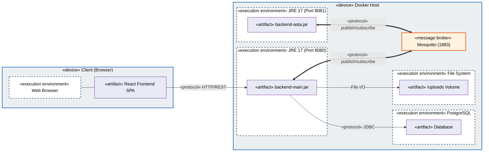
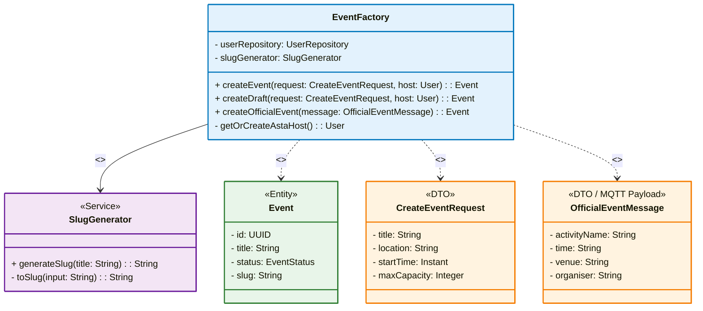
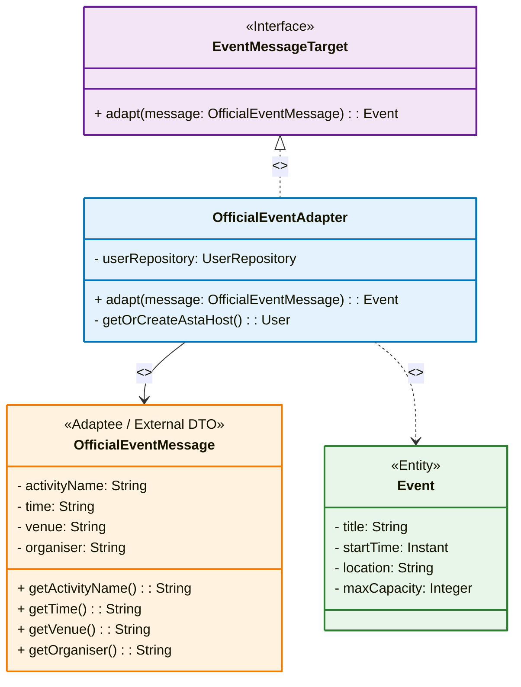
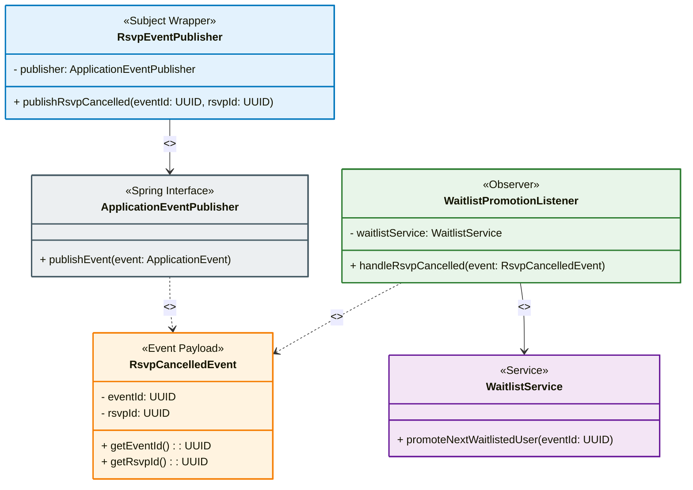

I have updated the presentation file with all **five final diagrams** as agreed. Below I list each diagram individually with its final code block, so you can verify they are the correct versions. They are now embedded in `MyStudyApp_Presentation.md` on Slides **9, 14, 15, 16, and 17**.

---

## Diagram 1: Verteilungsdiagramm (Slide 9)

---

## Diagram 2: OOD Domain Model – Full 22 Models (Slide 14)

```mermaid
classDiagram
    %% 1. IDENTITY MODULE (Blue)
    namespace identity {
        class User { <<Entity>> }
        class UserPreference { <<Entity>> }
        class VerificationToken { <<Entity>> }
        class PasswordResetToken { <<Entity>> }
        class Role { <<Enumeration>> }
        class TrustLevel { <<Enumeration>> }
    }
    style User fill:#e3f2fd,stroke:#0277bd,stroke-width:2px
    style UserPreference fill:#e3f2fd,stroke:#0277bd,stroke-width:2px
    style VerificationToken fill:#e3f2fd,stroke:#0277bd,stroke-width:2px
    style PasswordResetToken fill:#e3f2fd,stroke:#0277bd,stroke-width:2px
    style Role fill:#e3f2fd,stroke:#0277bd,stroke-width:2px
    style TrustLevel fill:#e3f2fd,stroke:#0277bd,stroke-width:2px

    %% 2. EVENTS MODULE (Green)
    namespace events {
        class Event { <<Entity>> }
        class Category { <<Entity>> }
        class EventCategory { <<Entity>> }
        class EventCategoryId { <<Embeddable>> }
        class EventMedia { <<Entity>> }
        class EventStatus { <<Enumeration>> }
        class MediaType { <<Enumeration>> }
    }
    style Event fill:#e8f5e9,stroke:#2e7d32,stroke-width:2px
    style Category fill:#e8f5e9,stroke:#2e7d32,stroke-width:2px
    style EventCategory fill:#e8f5e9,stroke:#2e7d32,stroke-width:2px
    style EventCategoryId fill:#e8f5e9,stroke:#2e7d32,stroke-width:2px
    style EventMedia fill:#e8f5e9,stroke:#2e7d32,stroke-width:2px
    style EventStatus fill:#e8f5e9,stroke:#2e7d32,stroke-width:2px
    style MediaType fill:#e8f5e9,stroke:#2e7d32,stroke-width:2px

    %% 3. REGISTRATION MODULE (Orange)
    namespace registration {
        class Rsvp { <<Entity>> }
        class RsvpStatus { <<Enumeration>> }
    }
    style Rsvp fill:#fff3e0,stroke:#f57c00,stroke-width:2px
    style RsvpStatus fill:#fff3e0,stroke:#f57c00,stroke-width:2px

    %% 4. MODERATION MODULE (Red)
    namespace moderation {
        class Review { <<Entity>> }
        class ReviewVote { <<Entity>> }
        class Report { <<Entity>> }
        class ReportReason { <<Enumeration>> }
        class ReportStatus { <<Enumeration>> }
    }
    style Review fill:#ffebee,stroke:#c62828,stroke-width:2px
    style ReviewVote fill:#ffebee,stroke:#c62828,stroke-width:2px
    style Report fill:#ffebee,stroke:#c62828,stroke-width:2px
    style ReportReason fill:#ffebee,stroke:#c62828,stroke-width:2px
    style ReportStatus fill:#ffebee,stroke:#c62828,stroke-width:2px

    %% 5. NOTIFICATION MODULE (Purple)
    namespace notification {
        class Notification { <<Entity>> }
        class NotificationType { <<Enumeration>> }
    }
    style Notification fill:#f3e5f5,stroke:#6a1b9a,stroke-width:2px
    style NotificationType fill:#f3e5f5,stroke:#6a1b9a,stroke-width:2px

    %% ==========================================
    %% INTERNAL DOMAIN BINDINGS (High Cohesion)
    %% ==========================================
    User *-- UserPreference
    User *-- VerificationToken
    User *-- PasswordResetToken
    User --> Role
    User --> TrustLevel

    Event *-- EventCategory
    Category "1" <--* "0..*" EventCategory
    EventCategory *-- EventCategoryId
    Event *-- EventMedia
    Event --> EventStatus
    EventMedia --> MediaType

    Rsvp --> RsvpStatus

    Review *-- ReviewVote
    Report --> ReportReason
    Report --> ReportStatus

    Notification --> NotificationType

    %% ==========================================
    %% CROSS-DOMAIN BINDINGS (Low Coupling)
    %% ==========================================
    User "1" --> "0..*" Event : hosts
    User "1" --> "0..*" Rsvp : makes
    User "1" --> "0..*" Review : writes
    User "1" --> "0..*" ReviewVote : casts
    User "1" --> "0..*" Report : files
    User "1" --> "0..*" Notification : receives

    Event "1" <-- "0..*" Rsvp : tracks
    Event "1" <-- "0..*" Review : receives
    Event "1" <-- "0..*" Report : flagged by
```

---

## Diagram 3: Factory Pattern (Slide 15)

---

## Diagram 4: Adapter Pattern (Slide 16)

---

## Diagram 5: Observer Pattern (Slide 17)

---

These five diagrams are now correctly placed in the final Markdown file. Your presentation is fully aligned with the agreed versions. Good luck! 🚀